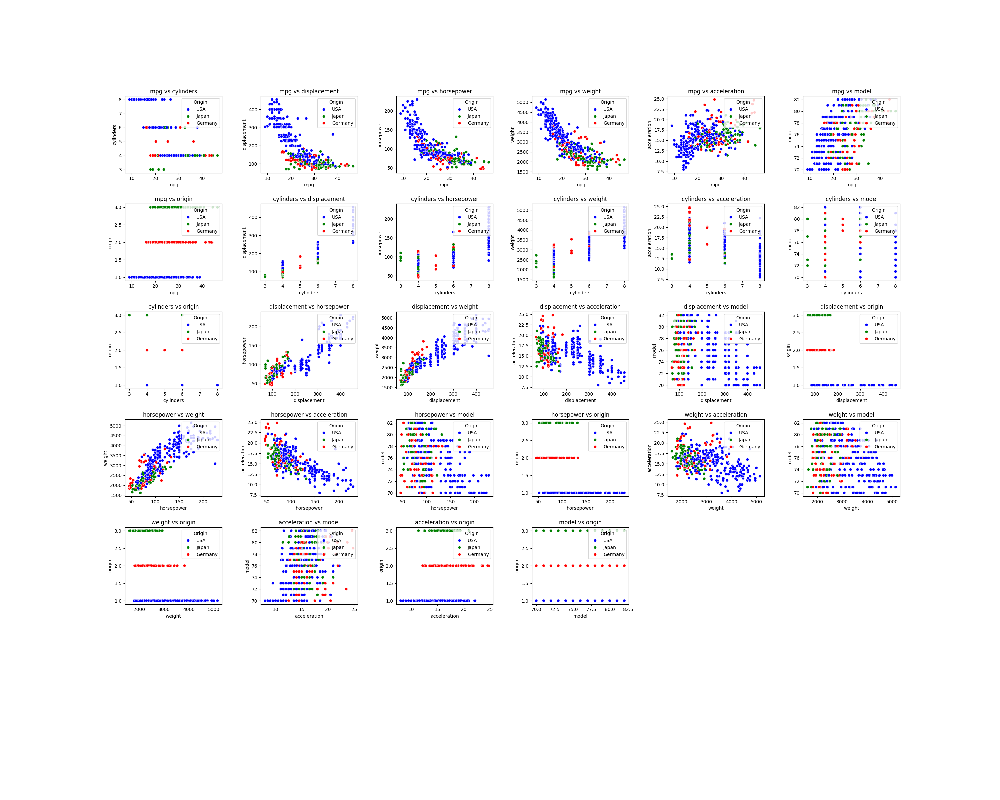
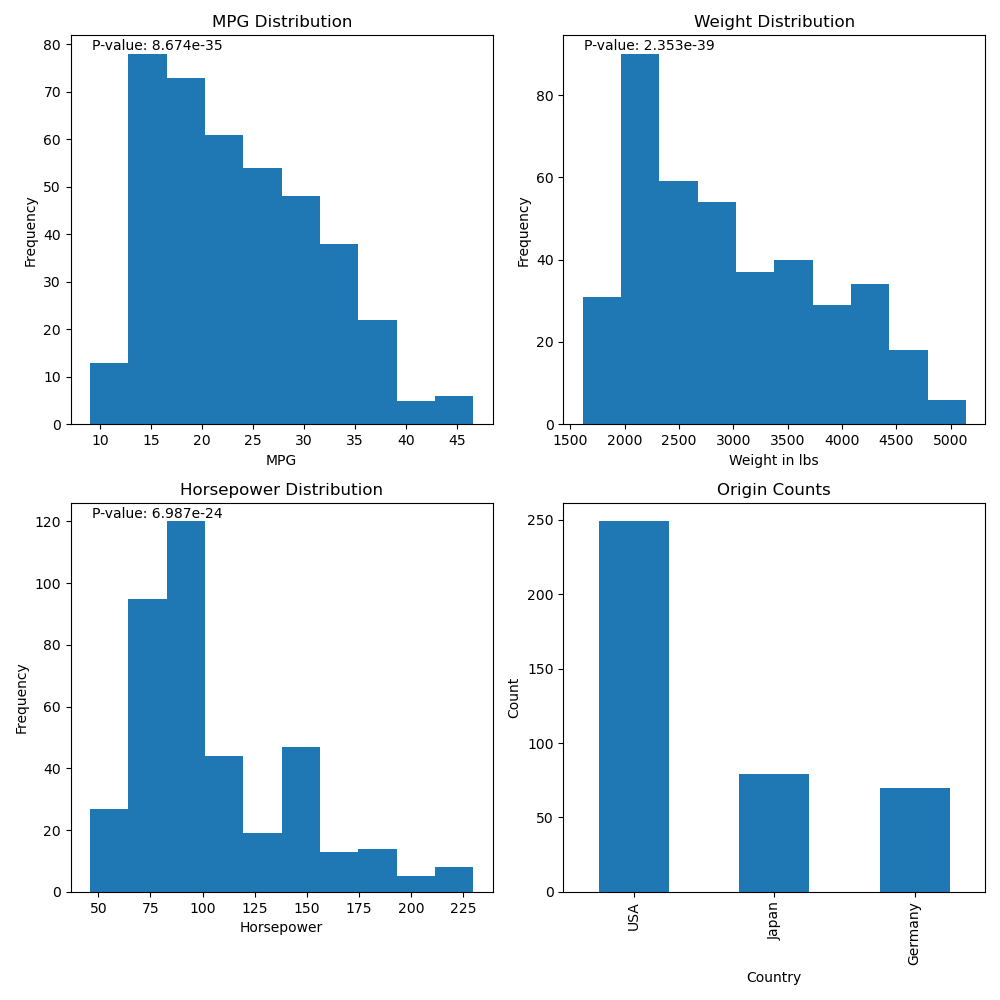
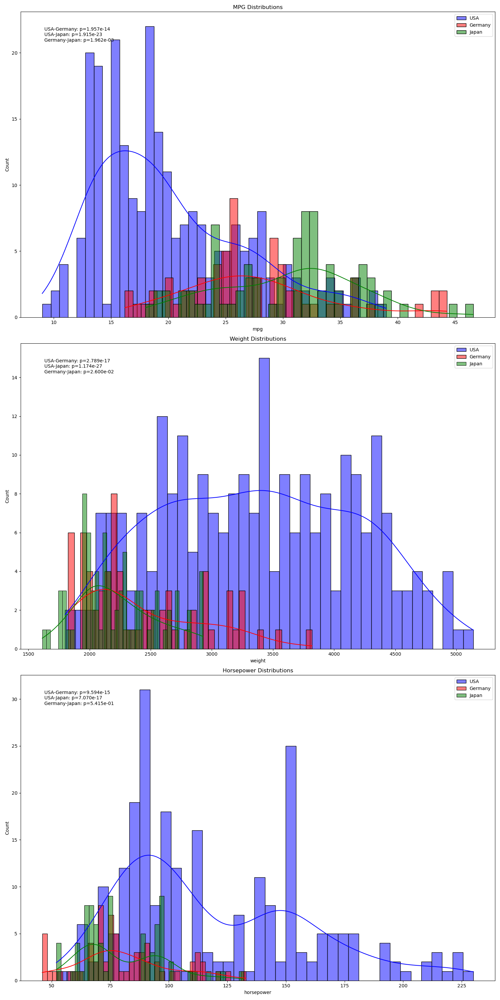

# Car Statistical Hypothesis Testing

## Table of Contents
1. [Vehicle Characteristics by Origin](#Vehicle-Characteristics-by-Origin)
    - [Part 1: Comparative Analysis](#Part-1)
    - [Part 2: Fuel Efficiency Comparison](#Part-2)
    - [Part 3: Weight Distribution Analysis](#Part-3)
2. [Future Work](#Future-work)
    - [Country of Origin Analysis](#Country-of-Origin-Analysis)
    - [Weight Differences by Origin](#Weight-Differences-by-Origin)
    - [Model Year and MPG](#Model-Year-and-MPG)

## Vehicle Characteristics by Origin

### Part 1

- **Question:** How do vehicles from different origins (USA, Germany, Japan) compare in terms of mpg, weight, and horsepower?
  - **Null Hypothesis $(H_0)$:** There is no significant difference in mpg, weight, and horsepower among vehicles from different origins.
  - **Alternate Hypothesis $(H_1)$:** There are significant differences in mpg, weight, and horsepower among vehicles from different origins.

#### Inference

- **MPG:** There is a statistically significant difference in the MPG among vehicles from different origins. 
    > Reject the `null hypothesis`.
- **Weight:** There is a statistically significant difference in the weight of vehicles from different origins. 
    > Reject the `null hypothesis` for weight.
- **Horsepower:** There is a statistically significant difference in horsepower among vehicles from different origins. 
    > Reject the `null hypothesis`.

### Part 2

**Question:** Are vehicles from Japan generally more fuel-efficient compared to those from the USA?
  - **Null Hypothesis $(H_0)$:** Vehicles from Japan are not significantly more fuel-efficient compared to those from the USA.
  - **Alternate Hypothesis $(H_1)$:** Vehicles from Japan are significantly more fuel-efficient compared to those from the USA.

#### **Inference:** 

Reject the `null hypothesis` - Vehicles from Japan are significantly more fuel-efficient compared to those from the USA.

### Part 3

**Question:** Is there a significant difference in the weight distribution of vehicles among the USA, Germany, and Japan?
- **Null Hypothesis $(H_0)$:** There is no significant difference in the weight distribution of vehicles among the USA, Germany, and Japan.
- **Alternate Hypothesis $(H_1)$:** There is a significant difference in the weight distribution of vehicles among the USA, Germany, and Japan.

#### **Inference** 

Reject the `null hypothesis` ($H_0$) for each comparison.

# Future work

### Country of Origin Analysis

- **Question:** How do vehicles from different countries of origin compare in terms of displacement and acceleration?

### Weight Differences by Origin

### Model Year and MPG

- **Question:** How does the mpg of vehicles vary across different model years?

# Collaborators

- Andrew Tolson 
- Simon Kanyiva 
- David Scott 
- Joel Encarnacion

